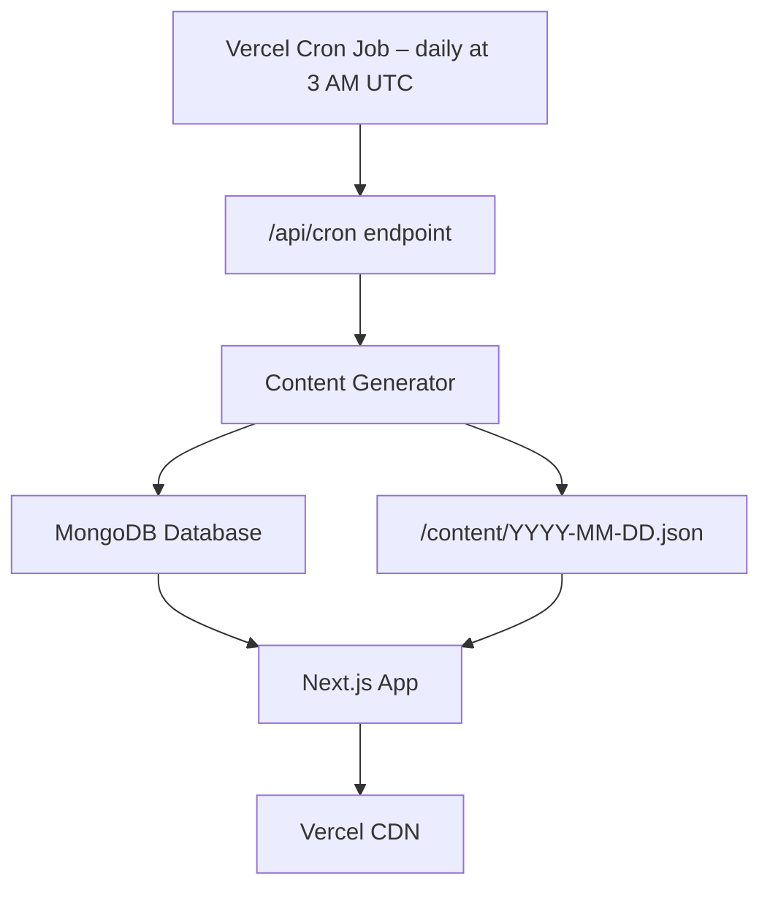

# Oh-My-Security (OMS)

A fully-automated, zero-cost website that publishes a fresh, structured breakdown of a real-world cyber-attack every day.

> Because security knowledge should be as fresh as today's headlines.

---

## 💡 About

Oh-My-Security is a daily cybersecurity education platform designed to help security professionals, students, and enthusiasts stay ahead of the latest threats. It analyzes real-world cyber attacks from both defensive (blue team) and offensive (red team) perspectives, providing comprehensive insights into threat detection, incident response, attack vectors, and exploitation techniques.

Our mission is to make cybersecurity knowledge accessible and current, ensuring you master cybersecurity one day at a time with real-world attack analysis.

---

## ✨ Features

- **Daily Content Pipeline** – Automatically pulls the day's top cybersecurity news, detects attack techniques, generates detailed blue-team (defense) and red-team (offense) write-ups, and stores them as structured JSON files.
- **Modern Next.js Front-end** – A stylish and responsive user interface built with Next.js, featuring distinct blue sections for defense strategies and red sections for offensive methodologies.
- **Content Archive** – Easily browse and access any previous day's article through a user-friendly navigation system.
- **Automated Vercel Cron Jobs** – A scheduled cron job automatically generates new daily content directly on the server, eliminating the need for repository commits.
- **Free-tier Infrastructure** – Leverages free-tier services for all operations, including NewsAPI for news aggregation, Hugging Face for AI inference, Vercel cron jobs for automation, and Vercel/Netlify for hosting, ensuring zero operational costs.

---

## 🚀 How It Works

Oh-My-Security operates on a fully automated pipeline to deliver fresh cybersecurity content daily:

1.  **Daily Cron Job**: A Vercel cron job is scheduled to run daily at 03:00 UTC, triggering the `/api/cron` endpoint.
2.  **Content Generation**: The content generator (a TypeScript application) is executed serverlessly:
    - It fetches the day's top cybersecurity headlines using NewsAPI.
    - It identifies the relevant attack technique through keyword analysis or Named Entity Recognition (NER).
    - It utilizes Hugging Face's free inference API to generate structured JSON content, detailing both blue-team and red-team perspectives of the attack.
3.  **Content Storage**: The generated JSON content is saved directly to the database (MongoDB) and also stored as `YYYY-MM-DD.json` files.
4.  **Real-time Updates**: Content is immediately available to users without requiring redeployment, as it's stored in the database and served dynamically.
5.  **Website Update**: The Next.js application fetches the latest content from the database, making it immediately available to users via the CDN.



---

## ⚙️ Tech Stack

| Layer                  | Choice                                                       |
| :--------------------- | :----------------------------------------------------------- |
| **Front-end**          | Next.js 14, Tailwind CSS, DaisyUI                            |
| **Content Generation** | Node.js 18, TypeScript, NewsAPI, Hugging Face free inference |
| **Automation**         | Vercel Cron Jobs scheduled workflow                          |
| **Hosting**            | Vercel Hobby (or Netlify / GitHub Pages)                     |
| **Storage**            | `/content` folder (version-controlled in Git)                |
| **Database**           | MongoDB (for subscribers and attack history)                 |

---

## 📂 Repository Layout

```
/oh-my-security
├── apps/
│   └── web           # Next.js front-end application
│       └── src/app/api/cron  # Vercel cron job endpoint
├── packages/
│   └── generator     # TypeScript CLI for daily content generation
├── content/          # Auto-generated JSON files, one per day (YYYY-MM-DD.json)
└── vercel.json       # Vercel configuration including cron job schedule
```

---

## 🚀 Quick Start (Local Development)

To get Oh-My-Security running on your local machine:

1.  **Clone the repository & Install dependencies:**

    ```bash
    git clone https://github.com/Aniket00736/oh-my-security.git
    cd oh-my-security
    npm install
    ```

2.  **Set up Environment Variables:**
    Create a `.env` file in the root of the project with your API keys:

    ```
    NEWS_API_KEY=your_newsapi_key
    HF_TOKEN=your_huggingface_token
    GOOGLE_API_KEY=your_google_api_key
    MONGODB_URI=your_mongodb_connection_string
    CRON_SECRET=your_random_cron_secret
    ```

    - Get your NewsAPI key from [newsapi.org](https://newsapi.org/register).
    - Get your Hugging Face token from your Hugging Face profile settings.
    - Get your Google Gemini AI API key from [aistudio.google.com/app/apikey](https://aistudio.google.com/app/apikey).
    - Set up a MongoDB Atlas cluster and get your connection string.
    - Generate a strong random string for `CRON_SECRET`.

3.  **Generate Today's Content (Optional, for testing generator):**

    ```bash
    cd packages/generator
    npm start
    ```

    This will create a new JSON file in the `content/` directory.

4.  **Run the Website:**

    ```bash
    cd apps/web
    npm run dev
    ```

    The website will be accessible at `http://localhost:3000`.

---

## 🌐 Deployment

Oh-My-Security is designed for easy deployment on various platforms:

1.  **Vercel (Recommended)**:

    - Import your repository into Vercel.
    - Configure the build command as `npm run build`.
    - Ensure the output directory is `.next`.
    - Set your environment variables (NEWS_API_KEY, HF_TOKEN, GOOGLE_API_KEY, MONGODB_URI, CRON_SECRET) directly in the Vercel dashboard.
    - Content generation is now handled by Vercel cron jobs, which run serverlessly and update content in real-time without requiring redeployment.

2.  **Netlify (Static)**:

    - For static site hosting, you can use `next export` during the build process and serve the `/out` directory.

3.  **GitHub Pages**:
    - Export the site and push the generated files to a `gh-pages` branch.

---

## 🔒 Security Considerations

Security is paramount in Oh-My-Security's design and operation:

- **Environment Variables**: All sensitive information (API keys, database credentials) are stored as environment variables and are **never** committed to version control. `.env.example` files are provided for documentation without real values.
- **Database Security**: MongoDB connections are secured with proper authentication, and input validation is implemented for all database operations to prevent injection attacks.
- **API Security**: CRON endpoints are protected with a `CRON_SECRET` for authenticated access. Input sanitization is applied to all user inputs.
- **Content Security**: Educational exploit code is clearly marked as examples. The project explicitly avoids including real malicious code or working exploits. AI-generated content is reviewed for ethical practices and accuracy.
- **No Sensitive Data**: The project does not store or expose any personal information or real email lists in the codebase or public repositories.

---

## 🤝 Contributing

We welcome contributions to Oh-My-Security! Please see our [CONTRIBUTING.md](CONTRIBUTING.md) for guidelines on how to contribute, set up your development environment, and follow our code style.

---

## 📄 License

This project is licensed under the MIT License. See the `LICENSE` file for details.

---

## 🙌 Credits

Built with ❤️ by [Aniket Pandey](https://linkedin.com/in/aniket00736).  
Follow me on [Twitter](https://x.com/lunatic_ak_) · [GitHub](https://github.com/pentoshi007).
