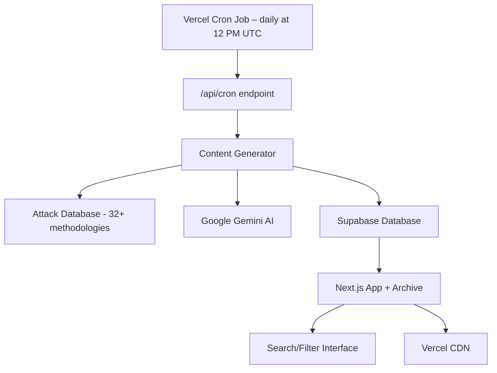

# Oh-My-Security (OMS)

A fully-automated, zero-cost website that publishes a fresh, structured breakdown of a real-world cyber-attack every day.

> Because security knowledge should be as fresh as today's headlines.

---

## 💡 About

Oh-My-Security is a daily cybersecurity education platform designed to help security professionals, students, and enthusiasts stay ahead of the latest threats. It analyzes real-world cyber attacks from both defensive (blue team) and offensive (red team) perspectives, providing comprehensive insights into threat detection, incident response, attack vectors, and exploitation techniques.

Our mission is to make cybersecurity knowledge accessible and current, ensuring you master cybersecurity one day at a time with real-world attack analysis.

---

## ✨ Features

- **Daily Content Pipeline** – Automatically pulls the day's top cybersecurity news, detects attack techniques, generates detailed blue-team (defense) and red-team (offense) write-ups, and stores them in Supabase database.
- **Modern Next.js Front-end** – A stylish and responsive user interface built with Next.js, featuring distinct blue sections for defense strategies and red sections for offensive methodologies.
- **Enhanced Archive System** – Powerful archive with real-time search, filtering by category, and sorting options. Browse all content with instant results.
- **Supabase Database Storage** – Reliable content storage in Supabase with instant access, no git conflicts, and better performance than file-based storage.
- **Email Subscription System** – MongoDB-powered subscription system allowing users to subscribe for updates and notifications.
- **Automated Vercel Cron Jobs** – Scheduled cron jobs generate new daily content directly on the server, storing in database for instant availability.
- **Free-tier Infrastructure** – Leverages free-tier services including NewsAPI, Google Gemini AI, Supabase database, MongoDB Atlas, and Vercel hosting.

---

## 🚀 How It Works

Oh-My-Security operates on a fully automated pipeline to deliver fresh cybersecurity content daily:

1.  **Daily Cron Job**: A Vercel cron job runs daily at 12:00 PM UTC (6:00 PM IST), triggering the `/api/cron` endpoint.
2.  **Content Generation**: The content generator executes serverlessly using methodology-driven approach:
    - Selects next attack methodology from comprehensive database (32+ attack types).
    - Fetches relevant cybersecurity headlines using NewsAPI with targeted search.
    - Utilizes Google Gemini AI to generate structured content with blue-team and red-team perspectives.
3.  **Database Storage**: Content is immediately stored in Supabase database with full metadata and searchable fields.
4.  **Real-time Access**: Content is instantly available through API endpoints without redeployment or git operations.
5.  **Enhanced Archive**: Users can search, filter, and sort through all content with real-time results via the modern web interface.



---

## ⚙️ Tech Stack

| Layer                  | Choice                                                       |
| :--------------------- | :----------------------------------------------------------- |
| **Front-end**          | Next.js 15, Tailwind CSS, DaisyUI, Lucide React Icons       |
| **Content Generation** | Node.js 20, TypeScript, NewsAPI, Google Gemini AI           |
| **Database**           | Supabase (PostgreSQL) for content, MongoDB Atlas for subscriptions |
| **Search & Filter**    | Real-time client-side filtering with React hooks            |
| **Automation**         | Vercel Cron Jobs (12:00 PM UTC daily)                       |
| **Hosting**            | Vercel (recommended) or Netlify                             |
| **Development**        | Homebrew Node.js, Cache management scripts                  |

---

## 📂 Repository Layout

```
/oh-my-security
├── apps/
│   └── web/                    # Next.js front-end application
│       ├── src/app/api/cron/   # Vercel cron job endpoint  
│       ├── src/app/archive/    # Enhanced archive with search/filter
│       └── src/lib/supabase.ts # Supabase database client
├── packages/
│   └── generator/              # TypeScript CLI for daily content generation
├── content/                    # JSON files (backup, primary storage is Supabase)
├── vercel.json                 # Vercel configuration with cron schedule
├── SUPABASE_SETUP.sql         # Database setup script
├── migrate-to-supabase.js     # Migration script from files to database
└── fix-dev-server.sh          # Development cache fix script
```

---

## 🚀 Quick Start (Local Development)

To get Oh-My-Security running on your local machine:

1.  **Clone the repository & Install dependencies:**

    ```bash
    git clone https://github.com/Aniket00736/oh-my-security.git
    cd oh-my-security
    npm install
    ```

2.  **Set up Environment Variables:**
    Create `apps/web/.env.local` file with your API keys:

    ```bash
    # Supabase Configuration (Required)
    SUPABASE_URL=your_supabase_project_url
    SUPABASE_ANON_KEY=your_supabase_anon_key
    SUPABASE_SERVICE_KEY=your_supabase_service_role_key

    # Content Generation APIs (Required)
    NEWS_API_KEY=your_newsapi_key
    GOOGLE_API_KEY=your_google_gemini_api_key

    # MongoDB for Subscriptions (Required)
    MONGODB_URI=your_mongodb_atlas_connection_string

    # Cron Security (Required)
    CRON_SECRET=your_random_secure_string
    ```

    **Get your API keys from:**
    - **Supabase**: Create project at [supabase.com](https://supabase.com) → Settings → API
    - **NewsAPI**: Register at [newsapi.org](https://newsapi.org/register)
    - **Google Gemini AI**: Get API key from [aistudio.google.com/app/apikey](https://aistudio.google.com/app/apikey)
    - **MongoDB Atlas**: Create cluster at [mongodb.com/atlas](https://mongodb.com/atlas)
    - **CRON_SECRET**: Generate a strong random string

3.  **Generate Today's Content (Optional, for testing generator):**

    ```bash
    cd packages/generator
    npm start
    ```

    This will create a new JSON file in the `content/` directory.

4.  **Run the Website:**

    ```bash
    cd apps/web
    npm run dev
    ```

    The website will be accessible at `http://localhost:3000`.

---

## 🌐 Deployment

Oh-My-Security is designed for easy deployment with modern database architecture:

### **Vercel (Recommended)**

1. **Set up Supabase Database**:
   - Create project at [supabase.com](https://supabase.com)
   - Run the SQL setup: Execute `SUPABASE_SETUP.sql` in Supabase SQL Editor
   - Migrate existing content: `node migrate-to-supabase.js`

2. **Deploy to Vercel**:
   - Import repository → Set root directory to `apps/web`
   - Configure environment variables in Vercel dashboard:
     ```bash
     SUPABASE_URL, SUPABASE_ANON_KEY, SUPABASE_SERVICE_KEY
     NEWS_API_KEY, GOOGLE_API_KEY, MONGODB_URI, CRON_SECRET
     ```
   - Vercel cron automatically handles daily content generation

3. **Benefits of New Architecture**:
   - ✅ **No Git Conflicts**: Content stored in database, not repository
   - ✅ **Instant Updates**: New content appears immediately
   - ✅ **Better Performance**: Database queries vs file system reads
   - ✅ **Scalable**: Handles thousands of concurrent users

### **Development Scripts**

- `npm run dev` - Start development server
- `npm run fix-dev` - Fix corrupted Next.js cache
- `npm run fresh-start` - Complete reset of development environment

---

## 🔒 Security Considerations

Security is paramount in Oh-My-Security's design and operation:

- **Environment Variables**: All sensitive information (API keys, database credentials) are stored as environment variables and are **never** committed to version control. `.env.example` files are provided for documentation without real values.
- **Database Security**: MongoDB connections are secured with proper authentication, and input validation is implemented for all database operations to prevent injection attacks.
- **API Security**: CRON endpoints are protected with a `CRON_SECRET` for authenticated access. Input sanitization is applied to all user inputs.
- **Content Security**: Educational exploit code is clearly marked as examples. The project explicitly avoids including real malicious code or working exploits. AI-generated content is reviewed for ethical practices and accuracy.
- **No Sensitive Data**: The project does not store or expose any personal information or real email lists in the codebase or public repositories.

---

## 🔍 New Features (Latest Update)

### **Enhanced Archive System**
- **Real-time Search**: Search by attack type, date, or category with instant results
- **Smart Filtering**: Filter content by attack categories with dynamic options
- **Flexible Sorting**: Sort by date (newest/oldest) or name (A-Z/Z-A)
- **Responsive Design**: Works perfectly on desktop and mobile devices

### **Supabase Migration**
- **Database Storage**: All content now stored in Supabase PostgreSQL for better performance
- **No Git Conflicts**: Content generation no longer creates repository commits
- **Instant Updates**: New content appears immediately without redeployment
- **API Endpoints**: RESTful APIs for content access and archive browsing

### **Development Improvements**
- **Cache Fix Scripts**: Automated solutions for Next.js development cache issues
- **Better Error Handling**: Improved error messages and fallback mechanisms
- **Enhanced Styling**: Fixed form visibility issues and improved user experience

---

## 🤝 Contributing

We welcome contributions to Oh-My-Security! Please see our [CONTRIBUTING.md](CONTRIBUTING.md) for guidelines on how to contribute, set up your development environment, and follow our code style.

---

## 📄 License

This project is licensed under the MIT License. See the `LICENSE` file for details.

---

## 🙌 Credits

Built with ❤️ by [Aniket Pandey](https://linkedin.com/in/aniket00736).  
Follow me on [Twitter](https://x.com/lunatic_ak_) · [GitHub](https://github.com/pentoshi007).
