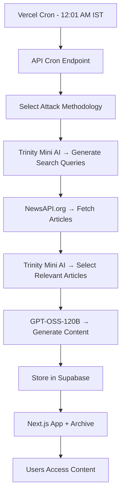

# Oh-My-Security (OMS)

A fully-automated, zero-cost cybersecurity education platform that delivers fresh, structured breakdowns of real-world attack methodologies every day.

> Master cybersecurity one day at a time with AI-powered attack analysis.

---

## 💡 About

Oh-My-Security is a daily cybersecurity education platform that helps security professionals, students, and enthusiasts stay current with the latest attack techniques and defense strategies. Each day features a different attack methodology analyzed from both defensive (blue team) and offensive (red team) perspectives, providing comprehensive insights into threat detection, incident response, attack vectors, and exploitation techniques.

Our mission is to make cybersecurity knowledge accessible, current, and practical - delivered fresh every day at 12:01 AM IST.

---

## ✨ Features

- **Automated Daily Content** – Vercel cron job runs daily at 12:01 AM IST, generating fresh content about a different attack methodology using OpenRouter AI (openai/gpt-oss-120b:free)
- **Modern Next.js Frontend** – Responsive UI built with Next.js 15, Tailwind CSS, and DaisyUI, featuring distinct blue sections for defense and red sections for offense
- **33+ Attack Methodologies** – Comprehensive database covering SQL injection, XSS, ransomware, phishing, zero-day exploits, supply chain attacks, and many more
- **AI-Powered News Search** – Trinity Mini AI generates smart search queries and selects the most relevant articles from NewsAPI.org for each daily topic
- **Beginner-Friendly Content** – AI-generated content uses simple, explanatory language so even beginners can understand every concept, while maintaining in-depth technical coverage
- **Enhanced Archive System** – Real-time search, filtering by category, sorting options, and instant results for browsing all past content
- **Supabase Database** – Lightning-fast content storage and retrieval with PostgreSQL, no git conflicts
- **Email Subscriptions** – MongoDB-powered subscription system for daily updates and notifications
- **100% Free Infrastructure** – Leverages free-tier services: NewsAPI.org, OpenRouter AI, Supabase, MongoDB Atlas, and Vercel

---

## 🚀 How It Works

Oh-My-Security operates on a fully automated pipeline:

1. **Daily Cron Job**: Vercel cron runs at 12:01 AM IST (6:31 PM UTC), triggering `/api/cron`
2. **Attack Selection**: Intelligently selects next attack from 33+ methodologies, avoiding recently covered topics
3. **News Gathering**: AI-powered 3-step pipeline:
   - **Query Generation**: Trinity Mini AI (`arcee-ai/trinity-mini:free`) generates smart search queries tailored to each attack topic
   - **Article Fetching**: Queries NewsAPI.org to find relevant cybersecurity articles
   - **Article Selection**: Trinity Mini AI evaluates and selects the most relevant articles from candidates
4. **AI Content Generation**: OpenRouter AI generates comprehensive breakdown with:
   - Attack overview and real-world context
   - Blue Team defense strategies and detection methods
   - Red Team attack techniques and exploitation details
   - Related news articles with cybersecurity context
5. **Database Storage**: Content instantly stored in Supabase PostgreSQL
6. **Real-time Access**: Available immediately through Next.js app with search and filtering


```mermaid
flowchart TD
    A[Vercel Cron - 12:01 AM IST] --> B["API Cron Endpoint"]
    B --> C[Select Attack Methodology]
    C --> D1["Trinity Mini AI → Generate Search Queries"]
    D1 --> D2["NewsAPI.org → Fetch Articles"]
    D2 --> D3["Trinity Mini AI → Select Relevant Articles"]
    D3 --> E["GPT-OSS-120B → Generate Content"]
    E --> F[Store in Supabase]
    F --> G[Next.js App + Archive]
    G --> H[Users Access Content]
```

---

## ⚙️ Tech Stack

| Layer | Technology |
|:------|:-----------|
| **Frontend** | Next.js 15, React, Tailwind CSS, DaisyUI |
| **Backend** | Next.js API Routes, TypeScript |
| **AI Generation** | OpenRouter AI (openai/gpt-oss-120b:free) |
| **AI News Search** | OpenRouter AI (arcee-ai/trinity-mini:free) |
| **News API** | NewsAPI.org with AI-powered relevance matching |
| **Database** | Supabase (PostgreSQL) for content storage |
| **Subscriptions** | MongoDB Atlas for email management |
| **Automation** | Vercel Cron Jobs (daily at 12:01 AM IST) |
| **Hosting** | Vercel with Edge Functions |
| **Styling** | Lucide React icons, custom animations |

---

## 📂 Repository Structure

```
/oh-my-security
├── apps/
│   └── web/                                        # Next.js application
│       ├── src/
│       │   ├── app/
│       │   │   ├── api/
│       │   │   │   ├── cron/route.ts               # Daily content generation + AI news pipeline
│       │   │   │   ├── archive/route.ts            # Archive data API
│       │   │   │   ├── content/[date]/route.ts     # Content by date API
│       │   │   │   ├── subscribe/route.ts          # Email subscription API
│       │   │   │   ├── revalidate/route.ts         # Cache revalidation
│       │   │   │   └── clear-cache/route.ts        # Cache clearing
│       │   │   ├── archive/
│       │   │   │   ├── page.tsx                    # Archive page (server)
│       │   │   │   └── ArchiveClient.tsx           # Archive client (search/filter)
│       │   │   ├── day/[date]/page.tsx             # Individual day view
│       │   │   ├── about/page.tsx                  # About page
│       │   │   ├── page.tsx                        # Home page
│       │   │   ├── layout.tsx                      # Root layout
│       │   │   └── globals.css                     # Global styles
│       │   ├── components/
│       │   │   ├── ContentDisplay.tsx              # Main content renderer
│       │   │   ├── ContentSection.tsx              # Blue/Red team section
│       │   │   ├── ContentTabs.tsx                 # Defense/Offense tabs
│       │   │   ├── Header.tsx                      # Navigation header
│       │   │   ├── Footer.tsx                      # Site footer
│       │   │   ├── SubscribeForm.tsx               # Email subscribe form
│       │   │   └── ScrollAnimationWrapper.tsx      # Scroll animations
│       │   ├── lib/
│       │   │   ├── content.ts                      # Content fetching utilities
│       │   │   ├── supabase.ts                     # Supabase client
│       │   │   ├── mongodb.ts                      # MongoDB client
│       │   │   └── generator/
│       │   │       ├── ai.ts                       # OpenRouter AI content generation
│       │   │       ├── attackDatabase.ts           # 33+ attack methodologies
│       │   │       ├── historyTracker.ts           # Attack rotation tracking
│       │   │       └── newsapi.ts                  # NewsAPI.org + Trinity Mini AI pipeline
│       │   ├── models/
│       │   │   └── Subscriber.ts                   # Email subscriber model
│       │   └── types/
│       │       └── content.ts                      # TypeScript type definitions
│       ├── public/
│       │   ├── favicon.svg                         # Site favicon
│       │   ├── manifest.json                       # PWA manifest
│       │   ├── robots.txt                          # Search engine directives
│       │   └── generate-icons.html                 # Icon generation utility
│       ├── package.json                            # Dependencies
│       ├── next.config.mjs                         # Next.js configuration
│       ├── tailwind.config.ts                      # Tailwind CSS config
│       ├── tsconfig.json                           # TypeScript config
│       ├── postcss.config.mjs                      # PostCSS config
│       ├── vercel.json                             # Vercel app settings
│       ├── next-env.d.ts                           # Next.js type declarations
│       └── test-generator.js                       # AI generation test script
├── package.json                                    # Root package config
├── package-lock.json                               # Dependency lock file
├── vercel.json                                     # Cron schedule configuration
├── SUPABASE_SETUP.sql                              # Database schema setup
└── README.md                                       # This file
```

---

## 🚀 Quick Start

### Prerequisites
- Node.js 18+ and npm
- Supabase account (free tier)
- MongoDB Atlas account (free tier)
- NewsAPI.org API key (free tier)
- OpenRouter API keys (free tier or paid)

### Installation

1. **Clone and install:**
   ```bash
   git clone https://github.com/pentoshi007/oh-my-security.git
   cd oh-my-security
   npm install
   ```

2. **Set up Supabase database:**
   - Create project at [supabase.com](https://supabase.com)
   - Go to SQL Editor and run `SUPABASE_SETUP.sql`
   - Get your project URL and keys from Settings → API

3. **Configure environment variables:**

   Create `apps/web/.env.local`:
   ```bash
   # Supabase (Required)
   SUPABASE_URL=your_supabase_project_url
   SUPABASE_ANON_KEY=your_anon_key
   SUPABASE_SERVICE_KEY=your_service_role_key

    # Content Generation (Required)
    NEWS_API_KEY=your_newsapi_key
    OPENROUTER_API_KEY=your_openrouter_blue_team_key
    OPENROUTER_RED_API_KEY=your_openrouter_red_team_key
    OPENROUTER_CODE_API_KEY=your_openrouter_exploit_code_key

    # AI News Search (Optional - falls back to OPENROUTER_API_KEY)
    OPENROUTER_SEARCH_API_KEY=your_openrouter_search_key

   # Email Subscriptions (Required)
   MONGODB_URI=your_mongodb_connection_string

   # Cron Security (Required for production)
   CRON_SECRET=your_random_secure_string
   ```

   **Get your API keys:**
   - **Supabase**: [supabase.com](https://supabase.com) → Project Settings → API
   - **NewsAPI.org**: [newsapi.org](https://newsapi.org/register) → API Key
   - **OpenRouter**: [openrouter.ai/keys](https://openrouter.ai/keys)
   - **MongoDB**: [mongodb.com/atlas](https://mongodb.com/atlas) → Connect → Connection String
   - **CRON_SECRET**: Generate with `openssl rand -base64 32`

4. **Run locally:**
   ```bash
   npm run dev
   ```

   Visit `http://localhost:3000`

---

## 🌐 Deployment (Vercel)

1. **Push to GitHub:**
   ```bash
   git add .
   git commit -m "Initial setup"
   git push origin main
   ```

2. **Deploy to Vercel:**
   - Go to [vercel.com](https://vercel.com)
   - Import your GitHub repository
   - Set root directory to `apps/web`
   - Add all environment variables from `.env.local`
   - Deploy!

3. **Verify cron job:**
   - Check Vercel dashboard → Cron Jobs
   - Should show: `31 18 * * *` (6:31 PM UTC = 12:01 AM IST)
   - First content will generate at next scheduled run

---

## 🎯 Key Features Explained

### AI-Powered News Search
Our 3-step AI pipeline ensures news articles are genuinely relevant to each day's attack topic:
1. **Query Generation**: Trinity Mini AI (`arcee-ai/trinity-mini:free`) analyzes the attack topic and generates 4 optimized search queries
2. **Article Fetching**: Queries are sent to NewsAPI.org to retrieve candidate articles
3. **Article Selection**: Trinity Mini AI evaluates all candidates and selects the most relevant articles based on topic match and cybersecurity context
- Automatic fallback to keyword-based search if AI is unavailable
- Each step has resilient error handling to ensure content is always generated

### Intelligent Attack Selection
- Rotates through 33+ attack methodologies
- Tracks recently used attacks to ensure variety
- Resets history after covering all topics
- Categories: Web, Network, Social Engineering, Malware, Cloud, API, and more

### Archive & Search
- Real-time client-side filtering
- Search by attack name, date, or category
- Sort by date or alphabetically
- Responsive design for all devices

---

## 🔒 Security & Privacy

- **No Hardcoded Secrets**: All API keys stored as environment variables
- **Secure Database**: Supabase with Row Level Security (RLS)
- **Protected Endpoints**: Cron routes secured with `CRON_SECRET`
- **Input Validation**: All user inputs sanitized
- **Educational Only**: No real malicious code or working exploits
- **Privacy First**: No personal data collection beyond email subscriptions

---

## 📊 Attack Coverage

Current database includes 33+ attack methodologies across categories:

- **Web Application Attacks**: SQL Injection, XSS, CSRF, XXE, SSRF, Command Injection
- **Network Attacks**: DDoS, Man-in-the-Middle, DNS Poisoning, ARP Spoofing
- **Malware**: Ransomware, Trojans, Rootkits, Keyloggers, Spyware
- **Social Engineering**: Phishing, Social Engineering, Pretexting
- **Authentication Attacks**: Brute Force, Session Hijacking, Password Spraying
- **Advanced Attacks**: APT, Zero-Day Exploits, Supply Chain Attacks
- **Data Attacks**: Data Breach, Data Exfiltration
- **Wireless Attacks**: Evil Twin, Bluetooth Attacks
- **Cryptocurrency Attacks**: Cryptojacking, Wallet Theft
- **Access Control**: Privilege Escalation
- **Configuration**: Security Misconfiguration
- **IoT**: IoT Botnets
- **Human Factor**: Insider Threats

---

## 🛠️ Development

**Available scripts:**
```bash
npm run dev          # Start development server
npm run build        # Build for production
npm run start        # Run production build locally
npm run lint         # Run ESLint
```

**Debugging cron locally:**
```bash
# Manually trigger cron endpoint
curl http://localhost:3000/api/cron \
  -H "Authorization: Bearer YOUR_CRON_SECRET"
```

---

## 🤝 Contributing

Contributions are welcome! Here's how:

1. Fork the repository
2. Create a feature branch (`git checkout -b feature/amazing-feature`)
3. Commit your changes (`git commit -m 'Add amazing feature'`)
4. Push to branch (`git push origin feature/amazing-feature`)
5. Open a Pull Request

Please ensure:
- Code follows existing style
- All tests pass
- Documentation is updated
- Commit messages are clear

---

## 📄 License

This project is licensed under the MIT License - see the LICENSE file for details.

---

## 🙌 Acknowledgments

Built with ❤️ for the cybersecurity community.

**Creator**: [Aniket Pandey](https://linkedin.com/in/aniket00736)
**Follow**: [Twitter](https://x.com/lunatic_ak_) · [GitHub](https://github.com/pentoshi007)

---

## 📈 Roadmap

- [ ] Add more attack methodologies (target: 50+)
- [ ] Implement user accounts and progress tracking
- [ ] Weekly digest emails for subscribers
- [ ] Interactive exploit demonstrations
- [ ] Community discussion forum
- [ ] Mobile app (React Native)
- [ ] Multi-language support

---

**Star ⭐ this repo if you find it useful!**
